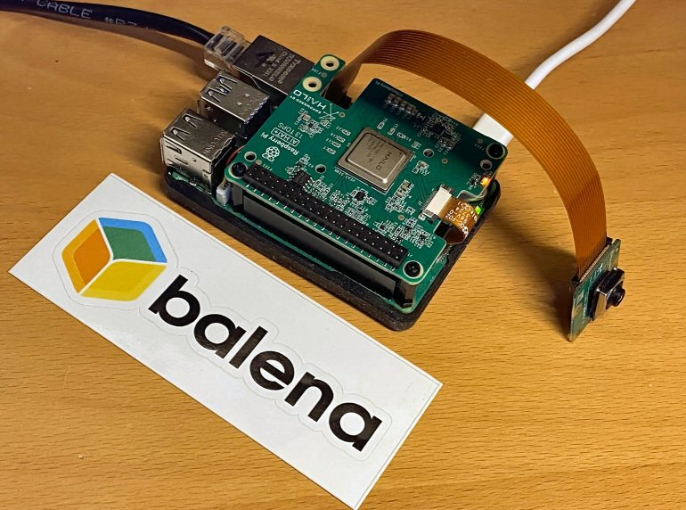

# Hailo AI HAT on balena Raspberry Pi 5

This project is a demonstration of how to install and use the hailo8 firmware on a Raspberry Pi 5 running balenaOS. The demo utilizes an attached Pi camera (V2 or V3) to display bounding boxes around objects detected by a neural network via the AI HAT.

This is a good template example of how to use a secondary location for kernel firmware and then load it onto the host from within a container.

## Usage:
Clone this project and then run the following from the root of the project, where `myFleet` is the name of your fleet on balenaCloud:
```
balena push myFleet
```

## Configuration

In order to make use of Gen 3 PCI, ensure that your device overlay setting on `https://dashboard.balena-cloud.com/devices/<DEVICE_UUID>/config` is set to the following:
```
"vc4-kms-v3d,cma-320","dwc2,dr_mode=host","dwc2,dr_mode=host,pciex1_gen=3"
```

Add the "Custom configuration" `BALENA_HOST_CONFIG_camera_auto_detect` with a value of `1` in the device configuration page. (This [configuration option](https://www.raspberrypi.com/documentation/computers/config_txt.html#camera_auto_detect) will automatically load overlays for recognized CSI cameras.)

You should also increase the "Define device GPU memory in megabytes." setting in the "Device configuration" to at least 64.

## Demo

Once the device is online, you can see the detections overlayed on the live video from the camera module in real time. You can view this video feed either by browsing to the public or local IP of the device, or via an HDMI-attached monitor.


You can find the IP address from the device's dashboard summary page, and optionally enable the [public device URL](https://docs.balena.io/learn/manage/actions/#public-device-url) to view the page from outside your network.


## How it works

### docker-compose
There are two significant items of note in the docker-compose file: 

We need a file location that we can tell the kernel to load firmware from, and this location needs to be a path the host can see. Therefore we create a named volume called `firmware-volume` that is bind-mounted to the host's `/run/mount/` directory (via extended volume fields). Note that it is not supported to mount anything outside of `/run/mount` for now as balenaOS makes no guarentees that those files and directories will exist in future versions. 


In addition, we use the [balena label](https://docs.balena.io/reference/supervisor/docker-compose/#labels) `io.balena.features.firmware` to bind mount the host OS `/lib/firmware` into the container.

### Dockerfile

Our Dockerfile adds apt repositories so we can download the Hailo deb packages as well as the Raspberry Pi OS camera apps. The Hailo software expects a system service to be running, but systemd is not really recommended to run in a container, so we "fake" one instead. (We strongly advocate for a multi-container architecture where different components of your application are separated into individual containers.)

We also install the `hailo-all` package that includes the Hailo kernel device driver and firmware, HailoRT middleware software, Hailo Tappas core post-processing libraries and the rpicam-apps Hailo post-processing software demo stages.

Note that our base image is simply an official Python image. 

### entry.sh

This script sets up a UDEV system to detect plugged hardware (necessary for the camera) and then calls the ai-setup script. (This UDEV system was formerly used in our deprecated balenalib library.)

### ai-setup.sh

This script is the main point of interest for this demo because it installs the firmware for the Hailo AI HAT. 

 - First it checks to see if the firmware is in our bind mount location. If not, it copies it there from the location it was installed in our container via hailo-all.
   
 - It tells the kernel to look in the new bind mount location for the firmware
   
 - It then reloads the kernel module via modprobe. This causes the firmware to be loaded from the newly specified location.


### Python web server

The `start.sh` script starts the `main.py` Python script which runs a simple Flask web server on port 8080. The Flask server starts one of the rpi-cam apps which actually performs the AI detections on the Hailo HAT and outputs the bounding boxes superimposed on the jpeg files which the webserver displays. The rpi-cam apps also use the libcamera library under the hood so it can send output directly to hdmi using a dedicated subsystem in linux kernel (DRM/KMS).

Flask server functionality:

- **Serves the UI:** When you connect to the server's main page (/), it sends your browser a basic HTML page.

- **Launches the Camera:** It starts the rpicam-vid command (with your YOLOv8 JSON file) as a background subprocess on the Pi.

- **Manages the Stream:** It captures the "gibberish" video output (the MJPEG stream) from that rpicam-vid subprocess.

- **Streams Video:** When your browser's HTML page asks for the /stream URL, the app parses the video output, finds the individual JPEG frames, and sends them one by one to your browser, which displays them as a video.

- **Auto-Restarts:** The whole process is wrapped in a while True loop, so if rpicam-vid ever crashes, the Python script automatically restarts it, making the stream very stable.

Hailo provides an [example repository](https://github.com/hailo-ai/hailo-rpi5-examples) if you'd like more control over the AI detection process and access to additional data, such as the coordinates of the bounding boxes, etc...

## Troubleshooting:
For all of the commands below open a terminal session to detector.
1. To confirm the the attached Pi camera is detected:
```
root@1933b87:/app# rpicam-hello --list-cameras -n -v
Available cameras
-----------------
0 : imx708 [4608x2592 10-bit RGGB] (/base/axi/pcie@1000120000/rp1/i2c@88000/imx708@1a)
    Modes: 'SRGGB10_CSI2P' : 1536x864 [120.13 fps - (768, 432)/3072x1728 crop]
                             2304x1296 [56.03 fps - (0, 0)/4608x2592 crop]
                             4608x2592 [14.35 fps - (0, 0)/4608x2592 crop]

    Available controls for 4608x2592 SRGGB10_CSI2P mode:
    ----------------------------------------------------
...
```

2. Check that the hailo device is correctly connected:
```
root@b432f02c44f7:~# hailortcli fw-control identify
Executing on device: 0001:01:00.0
Identifying board
Control Protocol Version: 2
Firmware Version: 4.20.0 (release,app,extended context switch buffer)
Logger Version: 0
Board Name: Hailo-8
Device Architecture: HAILO8L
Serial Number: HLDDLBB243201979
Part Number: HM21LB1C2LAE
Product Name: HAILO-8L AI ACC M.2 B+M KEY MODULE EXT TMP
```

3. While the demo is running, you can see the utilization of the HAT by running `hailo monitor`.
   
## Thanks

Based on code from https://github.com/shaunmulligan/ai-kit-demo
